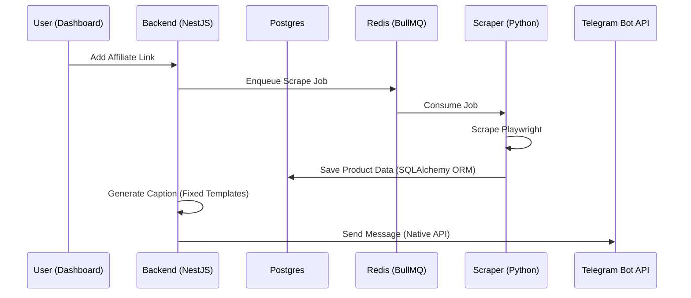

# 🏛️ Architecture | Arquitetura

[**English**](#🇺🇸-system-architecture) | [**Português**](#🇧🇷-arquitetura-do-sistema)

---

## 🇺🇸 System Architecture

Cadence Auto-Post is a monorepo multi-service system designed for high scalability and modularity. It separates the heavy scraping tasks from the main API and dashboard to ensure consistent performance.

### Component Overview
1. **Dashboard (Next.js)**: A modern UI built with shadcn/ui and Tailwind CSS for managing links, products, and posts.
2. **Backend API (NestJS)**: The brain of the system, handling database operations, queues, caption generation, and Telegram integration via Prisma and BullMQ.
3. **Scraper Worker (Python)**: A dedicated worker using Playwright and Chromium to extract product data from marketplaces without blocking the main event loop.

### Data Flow

---

## 🇧🇷 Arquitetura do Sistema

O Cadence Auto-Post é um sistema monorepo multi-serviço projetado para alta escalabilidade e simplicidade. Ele separa as tarefas pesadas de scraping da API principal para garantir uma performance consistente.

### Visão Geral dos Componentes
1. **Dashboard (Next.js)**: Interface moderna para gerir links, produtos e posts.
2. **Backend API (NestJS)**: Centraliza a inteligência do sistema, lidando com banco de dados, geração de legendas e integração nativa com o Telegram Bot.
3. **Scraper Worker (Python)**: Worker dedicado usando Playwright para extrair dados via ORM.

### Modelo de Dados (Resumo)
- **Product**: Armazena dados canônicos do produto (título, preço, imagens).
- **ProductVersion**: Histórico de snapshots para auditoria de preços.
- **AffiliateLink**: Vincula URLs de rastreamento a produtos coletados.
- **PostJob**: Estado e logs da postagem nativa.

---
*© 2026 Cadence Code | Built with rhythmic excellence.*
