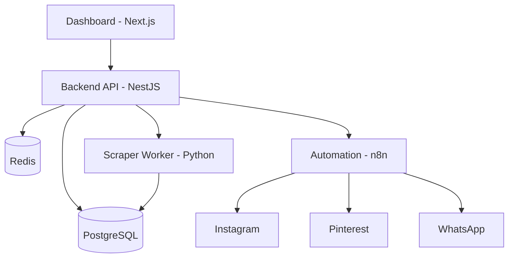

# 🤖 Cadence Auto-Post | AI-Powered Social Engine

[](https://opensource.org/licenses/MIT)
[](https://nodejs.org/)
[](https://www.python.org/)
[](https://www.docker.com/)

> **Rhythmic Excellence in Content Distribution.** Transform your social presence with the precision of **Cadence Code**.

[**English**](#-cadence-auto-post--ai-powered-social-engine) | [**Português**](#-cadence-auto-post--motor-social-ia)

---

## 🇺🇸 English Reference

### 🚀 Why Cadence Auto-Post?
Unlike generic posting scripts, **Cadence Auto-Post** is engineered as a high-performance engine for developers and businesses who demand authority without sacrificing time.

- **Intelligent Scheduling**: Cadence algorithms to prevent spam and maximize reach.
- **AI Copywriting**: Integrated with AI engines to generate high-conversion captions.
- **Multi-Platform Performance**: Simultaneous posting across Instagram, Pinterest, and WhatsApp with zero lag.
- **Scraper Powered**: Automatically extract product data from Mercado Livre (Magalu & Shopee coming soon) using Playwright.

### 🏗️ Architecture


### 🛠️ Tech Stack
- **Backend**: NestJS + Prisma + PostgreSQL
- **Queues**: BullMQ + Redis
- **Scraper**: Python + Playwright
- **Automation**: n8n
- **Dashboard**: Next.js 14 + Tailwind CSS + shadcn/ui
- **Infrastructure**: Docker + Docker Compose

### 🏁 Quick Start (5 min)
1. **Clone & Env**:
   ```bash
   git clone https://github.com/MauricioRFilho/auto-post.git
   cp .env.example .env
   ```
2. **Launch Services**:
   ```bash
   docker-compose up -d
   ```
3. **Database Migration**:
   ```bash
   cd backend && npm install && npx prisma migrate dev
   ```

Explore the [**QUICKSTART.md**](QUICKSTART.md) for detailed instructions.

---

## 🇧🇷 Português Reference

### 🚀 Por que usar o Cadence Auto-Post?
Diferente de scripts de postagem comuns, o **Cadence Auto-Post** foi refinado para ser um motor de consistência (cadência) para desenvolvedores e empresas que buscam autoridade sem perder tempo.

- **Agendamento Inteligente**: Algoritmos de cadência para evitar spam e maximizar alcance.
- **AI Copywriting**: Geração de legendas focadas em conversão via IA.
- **Performance Multi-Plataforma**: Postagem simultânea no Instagram, Pinterest e WhatsApp.
- **Scraper Inteligente**: Extração automática de dados do Mercado Livre (Magalu e Shopee em breve) via Playwright.

### 🏗️ Arquitetura
O sistema utiliza uma abordagem de micro-serviços via Docker, garantindo que o scraping não afete a performance da API principal.

### 🛠️ Stack Tecnológica
Consulte a seção em Inglês para a lista técnica completa.

### 🏁 Início Rápido
1. **Clone**: `git clone` do repositório.
2. **Docker**: `docker-compose up -d`.
3. **Prisma**: Execute as migrations na pasta `backend`.

Veja o guia detalhado em [**QUICKSTART.md**](QUICKSTART.md).

---

## 🏁 Powered by Cadence Code
This project is a living example of what we deliver to our clients: **AI-Speed + Technical Rigor**.

If your business needs a robust automation platform or wants to modernize an existing system to this level of quality, let's talk.

👉 [**Get a Free Project Diagnosis**](https://cadencecode.com.br/#diagnostico)

---

## 🤝 Contributing
Contributions are what make the open-source community such an amazing place to learn, inspire, and create. Please read [**CONTRIBUTING.md**](CONTRIBUTING.md) for details on our code of conduct and the process for submitting pull requests.

## 📄 License
Distributed under the MIT License. See `LICENSE` for more information.

---
*© 2026 Cadence Code | Built with rhythmic excellence.*
