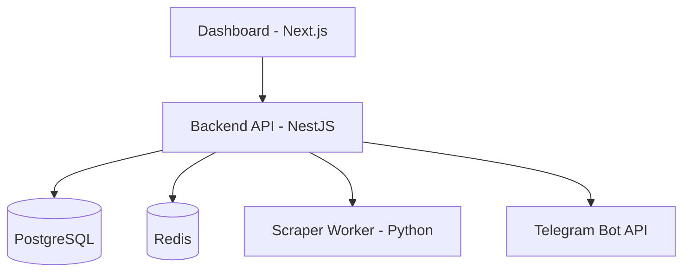

# 🤖 Cadence Auto-Post | Simplified Social Engine

  
  
  
  
  

---

### 🌐 [**Português**](#-cadence-auto-post--motor-social-simplificado) | [**English**](#-cadence-auto-post--simplified-social-engine-en) | [**Español**](#-cadence-auto-post--motor-social-simplificado-es)

---

## 🇧🇷 Cadence Auto-Post | Motor Social Simplificado

O **Cadence Auto-Post** é a ferramenta definitiva para afiliados e criadores que buscam consistência sem complexidade. Transforme links de marketplaces em posts lucrativos no Telegram com um único clique.

### 🌟 Funcionalidades
- **One-Click Setup**: Tudo via Docker, sem configurações manuais de código.
- **Telegram Nativo**: Postagens automáticas gratuitas em seus canais.
- **Scraper Inteligente**: Coleta automática de Mercado Livre, Magalu e Shopee.
- **Painel Visual**: Gerencie tudo por uma interface moderna e intuitiva.
- **Idiot-Proof**: Feito para quem não entende de programação.

### 🏁 Início Rápido (3 passos)
1. **Clone**: `git clone https://github.com/MauricioRFilho/auto-post.git`
2. **Setup**: Execute `bash setup.sh` e insira seu Token do Telegram.
3. **Dashboard**: Acesse `http://localhost:3000`.

---

## 🇺🇸 Cadence Auto-Post | Simplified Social Engine (EN)

**Cadence Auto-Post** is the ultimate tool for affiliates and creators looking for consistency without complexity. Turn marketplace links into profitable Telegram posts with a single click.

### 🌟 Features
- **One-Click Setup**: Everything via Docker, no manual code configurations.
- **Native Telegram**: Direct free postings to your channels.
- **Smart Scraper**: Auto-extraction from top marketplaces (ML, Magalu, Shopee).
- **Visual Dashboard**: Manage everything through a modern and intuitive UI.
- **Zero-Code**: Built for non-tech individuals.

---

## 🇪🇸 Cadence Auto-Post | Motor Social Simplificado (ES)

**Cadence Auto-Post** es la herramienta definitiva para afiliados y creadores que buscan constancia sin complejidad. Convierta enlaces de marketplaces en posts lucrativos en Telegram con un solo clic.

### 🌟 Funcionalidades
- **Setup en un clic**: Todo vía Docker, sin configuraciones manuales de código.
- **Telegram Nativo**: Publicaciones automáticas gratuitas en tus canales.
- **Scraper Inteligente**: Recopilación automática de Mercado Libre, Magalu y Shopee.
- **Panel Visual**: Gestione todo a través de una interfaz moderna e intuitiva.
- **Idiot-Proof**: Hecho para personas sin conocimientos de programación.

---

### 🏗️ Architecture | Arquitetura

### 📂 Links Úteis
- [**Setup Guide**](./docs/QUICKSTART.md) | [**User Manual**](./docs/USER_MANUAL.md) | [**Architecture**](./docs/ARCHITECTURE.md)

---
*© 2026 Cadence Code | Automação com Ritmo e Excelência.*
