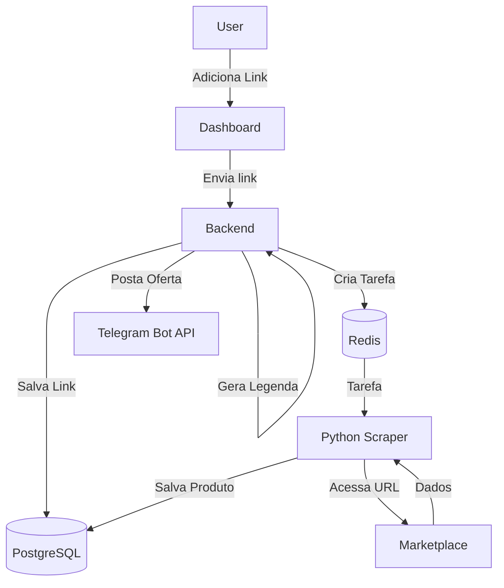

# 🏛️ Architecture | Arquitetura | Arquitectura

Welcome to the technical overview of the **Cadence Auto-Post** system. | Bem-vindo à visão técnica.

---

## 🇧🇷 Português (PT-BR)

### 🏗️ Visão Geral
O sistema foi projetado para ser modular e independente de ferramentas externas (como n8n), utilizando uma arquitetura de micro-serviços via Docker.

### 🧩 Componentes principais
1. **Dashboard (Next.js 14)**: Interface moderna e visual para gestão de links e produtos.
2. **Backend API (NestJS)**: O cérebro do sistema, orquestrando as filas (BullMQ) e integrações.
3. **Scraper Worker (Python + Playwright)**: Um worker dedicado para extrair dados de produtos de forma eficiente sem bloquear o sistema principal.
4. **Infraestrutura**: PostgreSQL (Banco de dados relacional) e Redis (Fila de mensagens).

---

## 🇺🇸 English (EN)

### 🏗️ Overview
The system is designed to be modular and independent of external tools, utilizing a micro-services architecture via Docker.

### 🧩 Core Components
1. **Dashboard (Next.js 14)**: Modern UI for link and product management.
2. **Backend API (NestJS)**: The brain of the system, orchestrating queues (BullMQ) and integrations.
3. **Scraper Worker (Python + Playwright)**: Dedicated worker for efficient product data extraction.
4. **Infrastructure**: PostgreSQL and Redis.

---

## 🇪🇸 Español (ES)

### 🏗️ Visión General
El sistema está diseñado para ser modular e independiente de herramientas externas, utilizando una arquitectura de micro-servicios vía Docker.

### 🧩 Componentes Principales
1. **Dashboard (Next.js 14)**: Interfaz moderna para la gestión de enlaces y productos.
2. **Backend API (NestJS)**: El cerebro del sistema, orquestando las colas (BullMQ) e integraciones.
3. **Scraper Worker (Python + Playwright)**: Worker dedicado para la extracción eficiente de datos de productos.

---

## 📊 Data Flow | Fluxo de Dados

---
[**← Voltar ao README**](../README.md)
